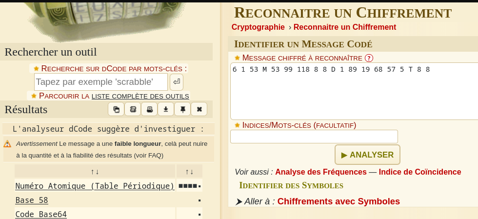
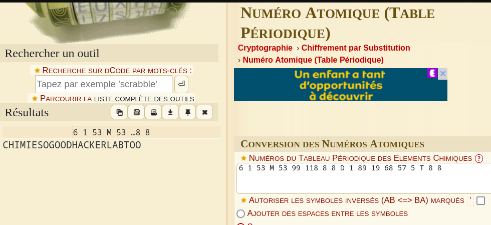

# Atom
```
30 pts
```
## Description
```
6 1 53 M 53 99 118 8 8 D 1 89 19 68 57 5 T 8 8

FLAG : CTF_[A-Z]

Author: 5c0r7

```

## Solution 

> Dans un premier temps nous devons identifier de quel type de chiffrement il s’agit. 
Nous pouvons utiliser la célèbre option de l’outil en ligne dcode (https://dcode.fr/ )  "Reconnaitre un chiffrement".





> Dcode nous à donc suggérer l’encodage “Numéro Atomique”. Nous remarquons que le nom de l’encodage correspond au challenge nous ne faisons donc pas fausse route. En utilisant l’encodage précédent on obtient : CHIMIESOGOODHACKERLABTOO




## Flag
```
CTF_CHIMIESOGOODHACKERLABTOO
```
