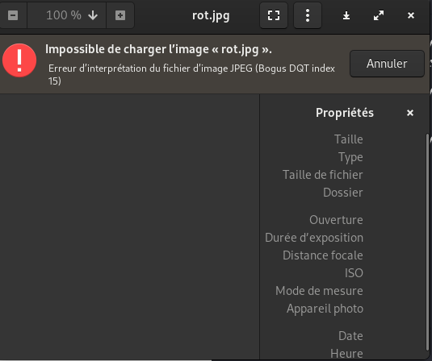
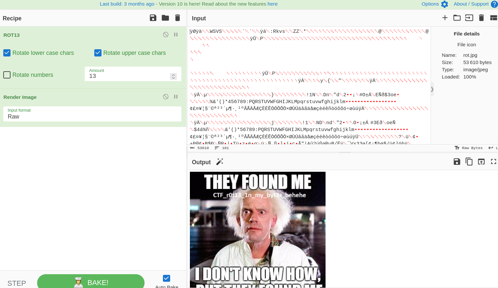

# Mateau de Tor
```
70pts
```
## Description
```
Author: W1z4rd
```
# Solution

>Ce challenge nous présente un fichier “rot.jpg”. En essayant d’afficher l'image, elle nous présente une erreur.



>Cela voudra dire qu’il faut s’attaquer au fond de l’image et non à sa forme. En d’autres termes à son contenu pour afficher la bonne image. Revenons au nom du challenge : “rot.jpg”. Parfois dans les CTFs même les noms des challenges peuvent être des indices. 
rot.jpg ??? 🤔 rot.jpg ?? 🤔 et si le contenu du fichier avait subi un ROT 13 ou 47. Essayons voir 😑
Toujours avec CyberChef si on veut pas écrire de script 😅 on peut réaliser cette opération.
On importe le fichier avec l’option disponible dans l’angle supérieur droit, on applique ensuite ROT13 et bingo  🥳 on obtient notre image.



# Flag
```
Flag : CTF_r0t13_1n_my_byt3s_hehehe
