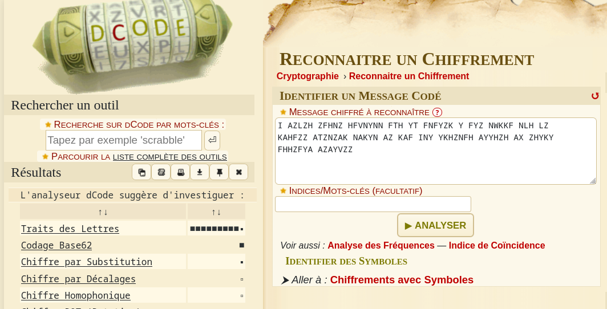

# Quelques traits dans ma lettre
```
30 pts
```
## Description
```
I AZLZH ZFHNZ HFVNYNN FTH YT FNFYZK Y FYZ NWKKF NLH LZ KAHFZZ ATZNZAK NAKYN AZ KAF INY YKHZNFH AYYHZH AX ZHYKY FHHZFYA AZAYVZZ

FLAG : CTF_[A-Z]

Author: 5c0r7

```

## Solution 

Dans un premier temps nous devons identifier de quel type de chiffrement il s’agit. 
Nous pouvons utiliser la célèbre option de l’outil en ligne dcode (https://dcode.fr/ )  # Reconnaitre un chiffrement.



Dcode nous à donc suggérer l’encodage "Traits des Lettres".
Nous remarquons que le nom de l’encodage correspond au challenge nous ne faisons donc pas fausse route.

En utilisant l’encodage précédent on obtient : ANOTHERCIPHERTOFIGUREOUT


## Flag
```
CTF_ANOTHERCIPHERTOFIGUREOUT
