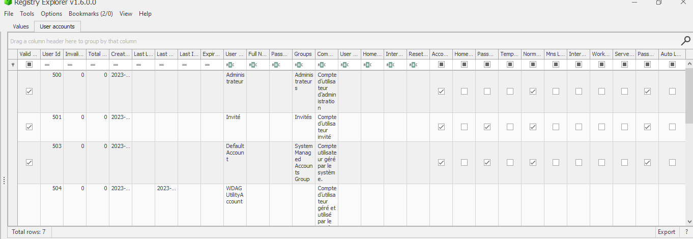
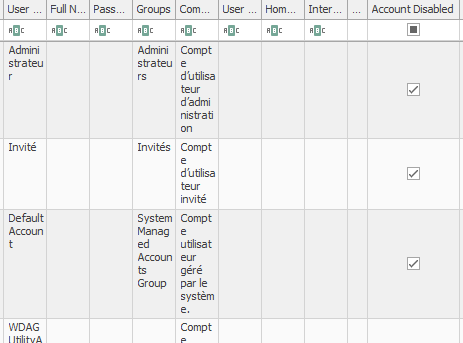
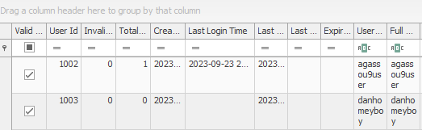

# 8 - Artefact
```
70 pts
```
## Description
```
L'équipe d'investigation en réponse aux incidents (IR) des gardiens des trésors a mené une opération de perquisition chez un membre du groupe DokounXosu.
Vous devez retrouver :

    Le nombre de comptes utilisateurs présents sur le système
    Le compte qui ne s'est jamais authentifié sur le système

```
## Outils utilisés

```
RegistryExplorer ( eric zimmerman tools)

```

## Solution

```
Les fichiers fournis , sont des fichiers de registre windows. Ces fichiers contiennent beaucoup d'informations sur les configurations
d'un système. Pour en savoir plus sur les registres: https://tryhackme.com/room/windowsforensics1
Comment trouver le nombre de comptes d'utilisateurs présent sur le système? Dans le fichier de registre SAM , à l'emplacement:
SAM\Domains\Account\Users
Il ne nous reste plus qu'a ouvrir ce fichier de registre dans registry explorer , et aller à l'emplacement indiqué

```



```
Sur l'image précedente , chaque ligne correspond à un utilisateur. Mais attention , il faut faire attention car certains des comptes de
ces utilisateurs ne sont pas actives.
Comment identifier les comptes des utilisateurs actifs?
Il faut identifier les lignes pour lesquelles la colonne " Account disabled" n'est pas cochée.
```



```
Les comptes actives sont: danhomeyboy , agassouuser , guardians
Quel utilisateur ne s'est jamais authentifié sur le système?
Il suffit de regarder dans la colonne "Last Login Time"
```



```
On peut remarquer que le compte danhomeyboy , n'a pas de date dans la colonne de "Last login Time". Il ne s'est donc jamais authentifier sur le système
```

## Flag

```
CTF_3:danhomeyboy

```


