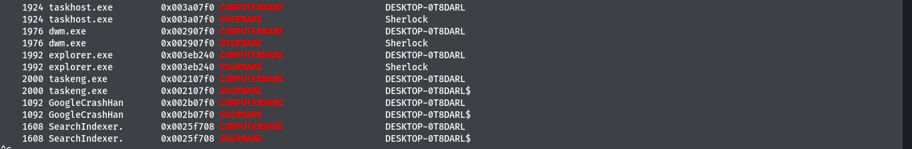
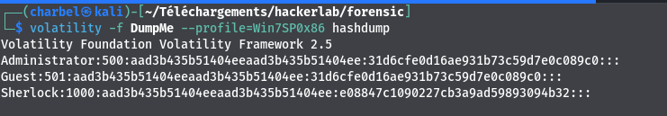

# 4-Forensic1
```
70 pts
```
## Description
```
L'ordinateur personnel d'un membre de la famille royale a été compromis. Aidez-nous à en savoir plus.
Veuillez retrouver:
-Nom de l'ordinateur
-Compte de l'utilisateur
-Son mot de passe
FLAG: CTF_hostname:username:password
```
## Outils utilisés
```
Volatility
Grep
john the ripper
```
## Solution
```
Comment pouvons nous obtenir le nom de l'ordinateur et le nom de l'utilisateur du système duquel provient le dump ?
Eh bien les variables d'environnement sont la solution.
Les variables d'environnement sous windows contiennent des paramètres de configuration utilisés par le système et les applications.
Les variables d'environnement qui nous interessent ici sont :
-computername
-username
Mais comment lister les variables d'environnement dans le dump mémoire?
Volatility is always the solution😁.
Nous utiliserons le plugin envars
```

`>>> volatility -f Dumpme --profile=Win7SP0x86 envars | grep -i -e computername -e username`



```
Nom de l'ordinateur:DESKTOP-0T8DARL
Nom de l'utilisateur:Sherlock
Ensuite nous devons trouver le mot de passe de l'utilisateur ( uzzer_hl)
Nous allons tout d'abord extraire le hash des mots de passe contenu dans le dump mémoire grâce au plugin hashdump de volatility,
et ensuite essayer de les cracker avec une attaque par dictionnaire
```
`>>> volatility -f Dump_forensic.mem --profile=Win7SP0x86 hashdump`



```
Ensuite nous crackons le hash du mot de passe de l'utilisateur sherlock grâce à l'outil john the ripper , et au dictionnaire rockyou.txt
```
`>>> echo "Sherlock:1000:aad3b435b51404eeaad3b435b51404ee:e08847c1090227cb3a9ad59893094b32:::" >hash_sherlock.txt`

`>>> john --wordlist=../../rockyou.txt hash_sherlock.txt --format=nt`


##Flag
```
CTF_DESKTOP-0T8DARL:Sherlock:tinkerbell

```


