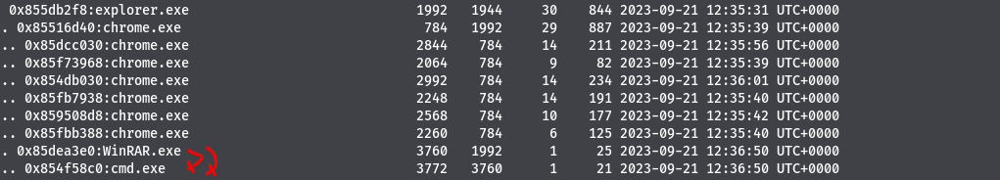

# 5- Forensic2
```
70 pts
```

## Description
```
Notre SOC nous a contactés au sujet d'un processus suspect détecté dans les journaux. Pouvez-vous, mener une enquête ?
Veuillez retrouver :

    Nom du processus suspect, y compris son extension
    PID du processus
    Heure de lancement
```
## Outils utilisés
```
Volatility
```
## Solution

```
Premièrement nous allons lister les processus en cours d'exécution sur la machine.
Nous utiliserons le plugin pstree de volatility pour afficher les processus dans une forme d'arborescence

```

`>>> volatility -f Dumpme --profile=Win7SP0x86 pstree `



```
En analysant la sortie de la commande , nous remarquons que le processus cmd.exe (invite de commandes) , a pour processus
parent Winrar.exe . C'est clairement un processus suspect . 
Comment touver l'heure de lancement de ce processus? 
La spécificité de cette challenge est que le l'heure affichée par la commande pslist , n'est pas la bonne heure.
En exécutant la commande imageinfo de volatility sur le dump mémoire:

```


```
Image date and time: 2023-09-21 12:43:06 UTC+0000 ( l'heure et la date à làquelle le dump mémoire a été pris ) 
Image local date and time :2023-09-21 13:43:06 +0100 ( l'heure et la date du système sur lequel le dump a éte pris)

L'heure de lancement fournie par la commande pstree pour le processus Winrar est donc en avance de 1h.
```

## Flag
```
CTF_Winrar.exe:3760:2023-09-21 11:36:50
```


