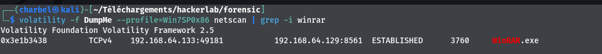
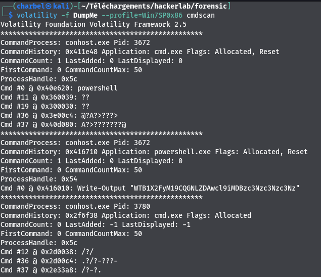
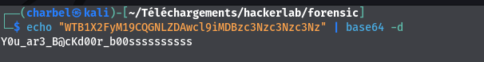

# 7- Forensic3
```
150 pts
```
## Description
```
Nous devons signaler cette cyberattaque. Veuillez identifier la personne responsable et déterminer l'une des premières actions qu'elle a prises.
Veuillez retrouver :

    IP de l'attaquant
    Port utilisé par l'attaquant
    Le message secret

FLAG: CTF_IP:PORT:SecretMessage
```
## Outils utilisés
```
Volatility
```
## Solution
```
Grâce au challenge forensic2 , nous savons déja que le prcessus Winrar est un processus suspect.
Nous allons donc regarder de plus près ce processus.
Si Winrar est un processus malveillant , il communique nécessairement un C2 ( command and control ).
Nous allons utiliser le plugin netscan de volatility , pour détecter une présence de connexion de la part du processus Winrar

```

`>>> volatility -f Dumpme --profile=Win7SP0x86 netscan | grep -i winrar `


```
Nous voyons une paire d'adresse IP et de port:
- 192.168.64.133:49181: c'est l'adresse IP et le port local , avec lequel Winrar établit la connexion. Pour illustrer mes propos nous pouvons considerer un cas d'utilisation avec l'outil netcat de linux: nc -l -s 192.168.64.133 -p 49181

- 192.168.64.129:8561 : addresse IP et port utilisé par l'attaquant

Identifions ensuite le message caché. Lorsqu'on execute la commande cmdscan pour identifier les commandes executées sur le
système, nous avons cette sortie:
```
`>>> volatility -f Dumpme --profile=Win7SP0x86 cmdscan `



```
Nous pouvons constater que la commande powershell Write-Output à été utilisé pour afficher le texte : WTB1X2FyM19CQGNLZDAwcl9iMDBzc3Nzc3Nzc3Nz.
On dirait du base64.
Essayons de le decoder:
```
`>>> echo "WTB1X2FyM19CQGNLZDAwcl9iMDBzc3Nzc3Nzc3Nz" | base64 -d `



## Flag
```
CTF_192.168.64.129:8561:Y0u_ar3_B@cKd00r_b00ssssssssss
```


