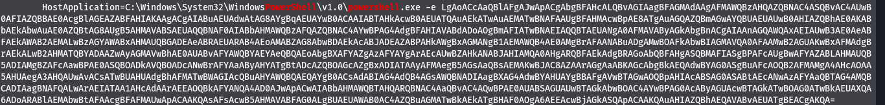
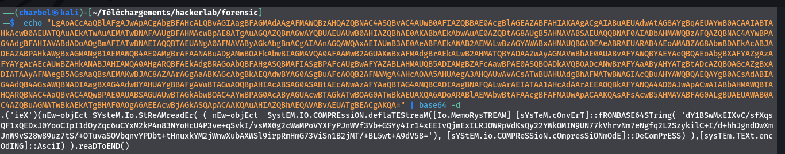
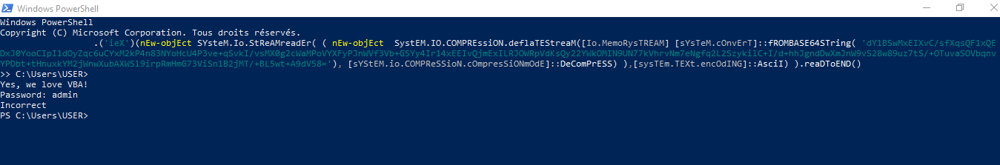
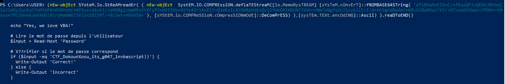

# 8 - Intrusion
```
70 pts
```
## Description
```
Cyberattaque du groupe DɔkunXɔsu sur la réserve nationale de trésors royaux du Bénin. Les analystes IR ont réussi à récupérer les logs des événements Windows.
```
## Outils utilisés
```
Powershell
evtxexport
```

## Solution
```
Nous avons un fichier log évenement comme artefact à analyser. Nous pouvons l'analyser sous windows avec Event viewer ou sous linux
grâce à l'outil evtxexport.
Analysons notre fichier avec evtxexport
```

`>>evtxexport HLB_forensics.evtx`

```
En analysant la sortie de la commande , nous avons identifier un évenement provenant de powershell assez interessant
```



```
C'est une commande powershell , dont les paramètres sont encodés en base64.
Nous allons le decoder:
```



```
Je ne suis pas encore un expert en powershell , j'ai pu identifier certaines instruction clé:

[sYsTeM.cOnvErT]::fROMBASE64STring : décode une chaine encodé en base64

[sysTEm.TEXt.encOdING]::AsciI : specifie un encodage ascii

L'étape suivante serait d'exécuter le script powershell , et d'observer son comportement.
Assurez vous d'executer ce code dans un sandbox , car on ne connait pas de manière exacte son fonctionnement.
Il ne faudrait pas causer par erreur des dégats à votre machine.
Il est temps d'executer ce code dans powershell

```


```
Quand nous exécutons toute le code , un mot de passe nous est demandé. Nous avons tenté des mots de passe par défaut , mais rien.
Nous avons donc décidé de n'exécuter qu'une partie du code :
(nEw-objEct SYsteM.Io.StReAMreadEr( ( nEw-objEct  SystEM.IO.COMPREssiON.deflaTEStreaM([Io.MemoRysTREAM] [sYsTeM.cOnvErT]::fROMBASE64STring( 'dY1BSwMxEIXvC/sfXqsQF1xQEDxJ0YooCIpI1dOyZqc6uCYxM2kP4n83NYoHcU4P3ve+qSvkI/vsMX0g2cWaMPoVYXFyPJnWVf3Vb+GSYy4Ir14xEEIvQjmExILRJOWRpVdKsQy22YWkOMIN9UN77kVhrvNm7eNgfq2L2SzykilC+I/d+hhJgndDwXmJnW9vS28w89uz7tS/+OTuvaSOVbqnvYPDbt+tHnuxkYM2jWnwXubAXWSl9irpRmHmG73ViSn1B2jMT/+BL5wt+A9dV58='), [sYStEM.io.COMPReSSioN.cOmpresSiONmOdE]::DeComPrESS) ),[sysTEm.TEXt.encOdING]::AsciI) ).reaDToEND()

```


##Flag
```
CTF_DokounXosu_its_g047_1nvbascript))

```


