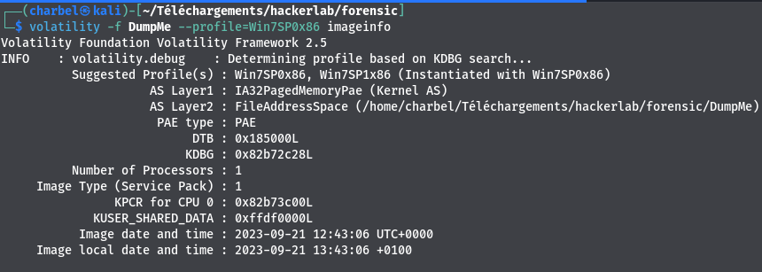
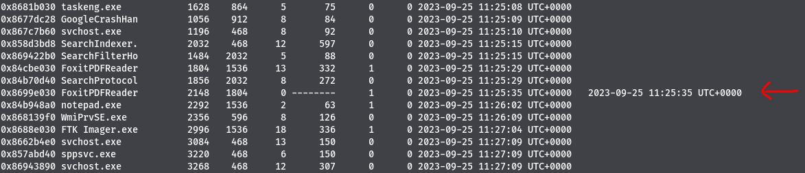

# 1-Investigation1
```
70 pts
```
## Description
```
Un logiciel a été démarré et aussitôt fermé. Quel est le nom de ce dernier?
Flag: CTF_[A-Za-z] 
```
## Outils utilisés
```
Volatility
```
## Solution
```
Après avoir télécharger le fichier mémoire , nous l'analyserons avec volatility. Volatility est un outil d'analyse mémoire (RAM) , et permet d'identifier les processus tournant sur la machine lors de la prise du dump mémoire. IL permet également de voir les fichiers ouverts , les commandes exécutées et pleins d'autres choses.
Afin d'analyser notre dump mémoire avec volatility , nous devons identifier son profile.
Nous utiliserons le plugin imageinfo de volatility pour cette tâche:
```
`>>> volatility -f Dump_forensic.mem imageinfo`


```
Volatility nous suggère comme profil de notre dump mémoire :  Win7SP0x86 et Win7SP1x86
L'étape suivante sera de lister les processus en cours d'exécution sur la machine lors de la prise du dump. Nous utiliserons le plugin pslist de volatility. Pslist permet de lister les processus en cours d'exécution ou les processus arrêtés lors de la prise du dump mémoire.
```
`>>> volatility -f Dump_forensic.mem --profile=Win7SP0x86 pslist`


```
Le plugin pslist de volatility , affiche l'heure de début et l'heure de fin d'un processus. Les processus ne possédant pas d'heure de fin dans la sortie de la commande pslist , sont des processus qui étaient toujours en cours d'exécution lors de la prise du dump mémoire.
En analysant la sortie de la commande , on remarque que le processus FoxitPDFReader a démarré a 11:25:35 et a pris fin a 11:25:35.
Ce processus s'est arrêté automatiquement après son démarrage.
```
## Flag
```
CTF_FoxitPDFReader

```
