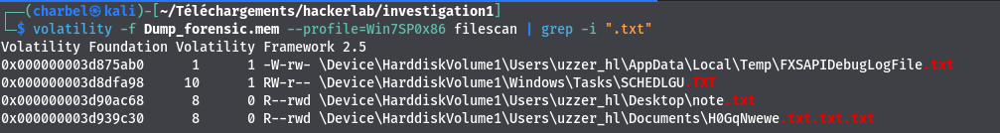
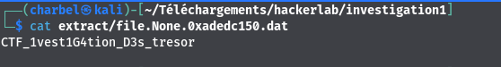

# 3-Investigation3
```
70 pts
```
## Description
```
Un fichier txt est ouvert lors du dump de la mémoire. Le fichier est situé dans le dossier Documents. Un flag est contenu dans le
fichier
```
## Outils utilisés
```
Volatility
Grep
```
## Solution
```
Le challenge nous précise qu'un fichier txt est ouvert  et qu'il est présent dans le répertoire Documents. 
Comment pouvons nous identifier les fichier ouverts présents dans le dump mémoire?😔
Heureusement , volatility a la solution 😃. Le plugin filescan permet d'identifier tout les fichiers ouverts lors de la prise
du dump mémoire. Nous utiliserons donc ce plugin et filtrerons en fonction de l'extension
```

`>>> volatility -f Dump_forensic.mem --profile=Win7SP0x86 filescan | grep -i ".txt"`


```
En analysant la sortie de la commande nous pouvons identifier un fihier nommé H0GqNwewe.txt.txt.txt , et situé dans le répertoire
Documents.
Serait-ce notre fichier?🧐
L'etape suivant sera d'extraire ce fichier. Mais comment ?😭.
Volatility a la solution comme d'habitude🥹. Le plugin dumpfiles , nous permet d'extraire les fichiers présents dans un dump
mémoire
```
`>>> volatility -f Dump_forensic.mem --profile=Win7SP0x86 dumpfiles -Q 0x000000003d939c30 -D ./extract`

## Explication de la commande 
```
L'option -Q permet de specifier l'offset(addresse)  du fichier dans le dump mémoire
L'option -D permet de specifier le repertoire de destination ou le fichier extrait doit être mis
```


```
Il ne nous reste qu'a afficher le contenu du fichier extrait , afin de voir son contenu.

```


## Flag
```
CTF_1vest1G4tion_D3s_tresor
```

