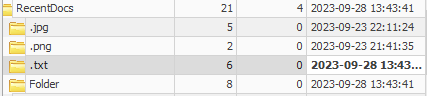
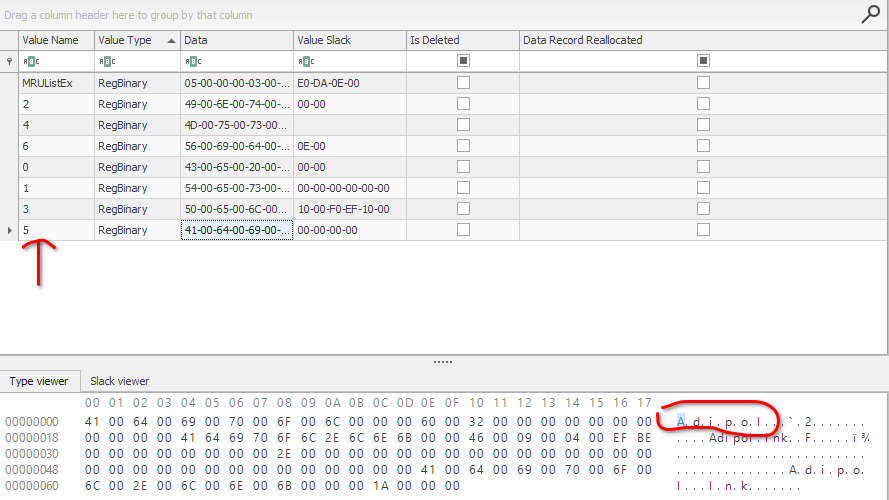
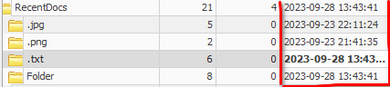
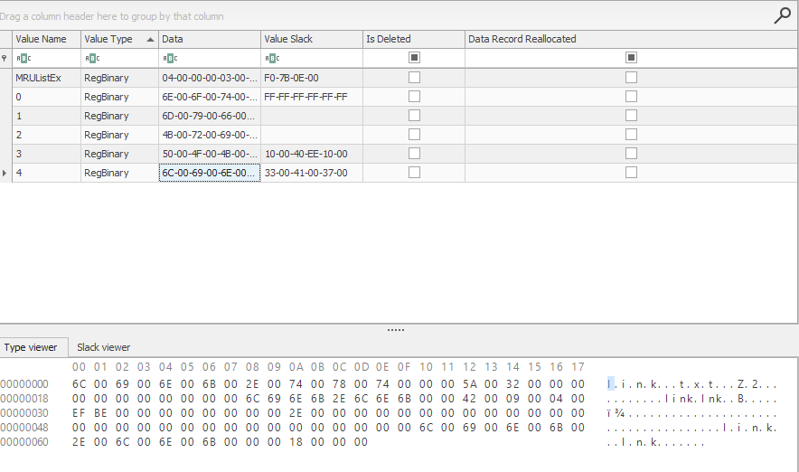

# 10- Last Action
```
170 pts

```
## Description
```
L'équipe d'investigation en réponse aux incidents (IR) des gardiens des trésors a mené une opération de perquisition chez un membre du groupe DokounXosu.

Vous êtes chargé de trouver les éléments suivants :

    Le fichier le plus récemment modifié par l'utilisateur sur la machine, y compris son extension
    La date à laquelle ce fichier a été ouvert, au format yyyy-mm-dd hh:mm:ss
    Le nom du répertoire où se trouve ce fichier
```
## Outils utilisés
```
Registry explorer

```
## Solution

```
Le fichier le plus récemment ouvert sur la machine? Nous pouvons accéder à cette information dans le registre NTUSER.DAT , à
l'emplacement: NTUSER.DAT\Software\Microsoft\Windows\CurrentVersion\Explorer\RecentDocs
```


```
Voici les informations pouvant être obtenues à cette location:
Folder: Contient les répertoires récemment ouvert. La dernière entrée dans cette liste , est l'entrée la plus récente
.txt : contient les fichiers .txt les plus récemment ouvert
.png: contient les images les plus récemment ouvert
.jpg: contient les images les plus récemment ouvert

Comment identifier le répertoire le plus récemment ouvert?
Cette information est situé à NTUSER.DAT\Software\Microsoft\Windows\CurrentVersion\Explorer\RecentDocs\Folder
```



```
Nous savons à présent le repertoire le plus récemment ouvert.
Mais comment pouvons nous trouver le fichier le plus récemment ouvert?
```



```
On remarque que l'entrée contenant les fichiers .txt récemment ouvert  , est celle possède la date d'écriture la plus récente: 2023-09-28 13:43:41
On peut déja dire que c'est un fichier .txt qui à été ouvert récemment.
Identifions donc ce fichier
```



```
On peut donc conclure que c'est le fichier link.txt , qui à été le plus récemment ouvert.
Vu que c'est le répertoire adipol , qui à été le plus récemment ouvert , donc le fichier link.txt est contenu dans ce répertoire.
```

## Flag

```
CTF_link.txt:2023-09-28 13:43:41:adipol
```
