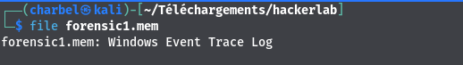
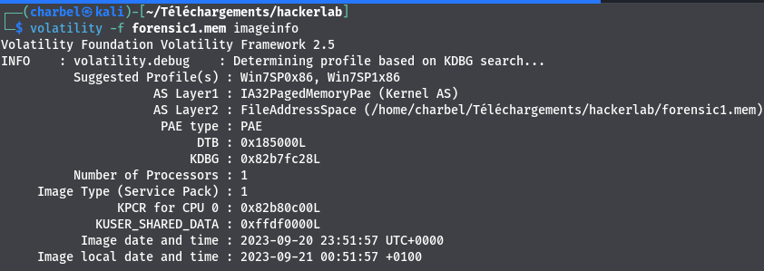
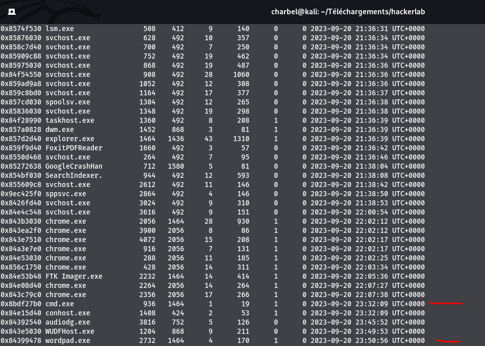
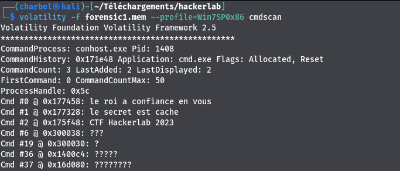
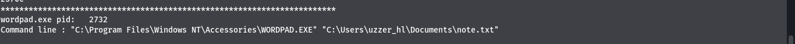
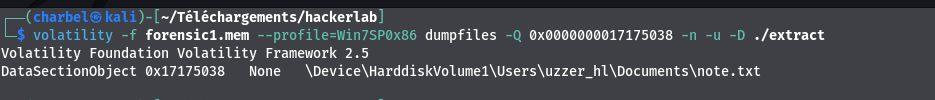
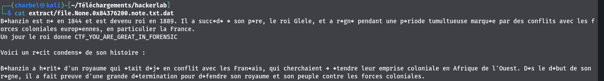

# 6- Show_me 
```
150 pts
```
## Outils utilisés
```
file
Volatility

```

## Solution
```
Après avoir télécharger le fichier , j'utilise l'outil file pour determiner le type du fichier.
```

`>>> file forensics.mem`



```
Nous allons analyser ce fichier avec volatility
```
`>>> volatility -f forensics1.mem imageinfo`



`>>> volatility -f forensics.mem --profile=Win7SP0x86 pslist `




```
Nous pouvons identifier deux processus interessant:
cmd.exe ( invite de commandes sous linux)
wordpad.exe ( logiciel utilisé pour modifier des fichiers )
Identifions à present les commandes exécutées sur le système
```
`>>> volatility -f forensics1.mem --profile=Win7SP0x86 cmdscan `



```
Nous pouvons identifier les entrées suivantes:
le roi a confiance en vous
le secret est cache
CTF Hackerlab 2023

Rien d'interessant, mais nous savons que nous devons chercher plus loin😆
Quel ligne de commande a été utilisé pour lancer le programme wordpad.exe ?
```
`volatility -f forensics1.mem --profile=Win7SP0x86 cmdline | grep -i wordpad`



```
Le programme wordpad a été utilisé pour ouvrir le fichier note.txt.
Nous allons extraire ce fichier et voir son contenu😋
```
`>>> volatility -f forensics1.mem --profile=Win7SP0x86 dumpfiles -Q 0x0000000017175038 -D ./extract `



`>>> cat extract/file.None.0x84376200.note.txt.dat`



## Flag
CTF_YOU_ARE_GREAT_IN_FORENSIC


