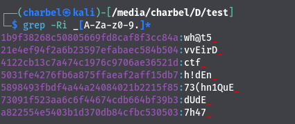
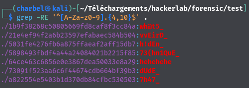

# 11- Weird lsb
```
200 pts

```
## Description
```
[FR]

Une technique étrange a été utilisée par les assaillants pour cacher un trésor. Aidez les gardiens à le retrouver.

ROW LSB RGB 111 000
[EN]

A strange technique was used by the attackers to hide treasure. Help the guards find him.

ROW LSB RGB 111 000

FLAG : ctf_[A-Za-z0-9.]

Author: 5c0r7

```
## Solution 

Le défi nous présente un fichier image png "hidden.png". Et nous avons comme inscription "ROW LSB RGB 111 000". Cela nous fait penser à la technique LSB utilisé pour cacher des informations dans les fichiers . 

Pour extraire ces LSB nous pouvons utilisé une ressources externes (https://stegonline.georgeom.net/extract). Après avoir uploader notre image nous sélectionnons l'option extract data . A ce niveau nous allons activer les rgbs 111 et 000. L'extraction nous donne un fichier RAR "hidden.rar". 


Lorsque nous tentons d'extraire le contenu de l'archive à l'aide de la commande unrar, un mot de passe est demandé. Cependant, le défi ne nous a pas fourni explicitement le mot de passe, donc nous devons le découvrir par nos propres moyens😪😪.

Heureusement, Mr John the Ripper est là pour nous aider à retrouver ce mot de passe, si cela est dans ses cordes. Pour utiliser John the Ripper, nous devons commencer par exécuter la commande suivante :

`>>>rar2john hidden.rar > hash.txt`

La commande génère un hash du fichier "hidden.rar" et le transfère dans un fichier nommé "hash.txt"

Ensuite, vous devrez exécuter la commande `>>>john hash.txt --wordlist=rockyou.txt` pour essayer de trouver le mot de passe.

Après avoir exécuté cette commande, vous obtiendrez le mot de passe : "amazing03".

Vous pourrez ensuite utiliser ce mot de passe pour extraire le ou les fichier(s) contenu dans l'archive.

Après avoir extrait tout les fichiers de l'archive , vous pourrez constater qu'il y'a plusieurs fichiers.
Comment trouver le flag dans cette tonne de fichier? Grep est notre ami.😁



Nous pouvons extraire ce flag: ctf_wh@t5_7h47_vvEirD_h!dEn_73(hn1QuE_dUdE_
Nous avons essayé ce flag , mais sans succès. 
Il manque certainement , une partie a la fin du flag.
Nous avons donc effectué un grep , mais en filtrant en fonction des chaînes possédant une longeur minimale et une longeur maximale

`grep -RE '^[A-Za-z0-9].{4,10}$' .`



## Flag
```
ctf_wh@t5_7h47_vvEirD_h!dEn_73(hn1QuE_dUdE_hehehehe

```
