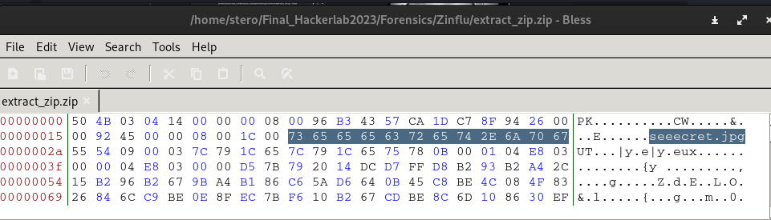

# 12 Zinflu 
```
500 pts
```

## Description
```
Adjoxosu, un membre de DokounXosu, met aux enchères l'un des trésors royaux qu'ils ont réussi à dérober aux gardiens des trésors.
```
## Outils utilisés
```


```
## Solution
```
Le challenge ne nous fournit pas d'artefact à utiliser. Nous sommes sûrement supposé faire de l'OSINT.
Nous avons commencer a faire de l'OSINT sur le nom : AdjoXosu.
Nous avons trouver un compte twitter: https://twitter.com/adjoxosu

```


```
Sur le profil twitter , nous avons également trouvé un lien vers une page github

```


```
En fouillant dans les commits du dépôt github nous sommes tombés sur ceci
```
 

```
C'est de l'hexadécimal . On a pu reconnaître au début le nombre magique des fichiers zip: 50 4b 03 04 
Nous utilisons donc cyberchef pour avoir obtenir le fichier zip.

```


```
Nous avons donc récuperer le fichier zip et avions essayer de l'ouvrir

```


L'erreur que nous rencontrons est liée au nom du fichier dans l'archive ZIP. Pour mieux comprendre ce problème, nous allons consulter Wikipedia pour en apprendre davantage sur le format ZIP. 


Nous savons maintenant quels sont les octets spécifiques au nom du fichier. Ouvrons donc notre fichier extract_zip.zip avec Bless. Qu'observons-nous ? Nous remarquons que les octets qui définissent la taille du nom du fichier sont définis sur '08 00', ce qui signifie en hexadécimal qu'il s'agit de 8 octets, tout simplement.


Vérifions maintenant si le nombre d'octets du nom du fichier ZIP correspond effectivement à 08 octets :



En continuant d'observer le fichier avec notre éditeur Bless, nous remarquons que le nombre d'octets réservés pour le nom du fichier ZIP, "seeecret.jpg", est de 12 octets et non 8 octets, ce qui est probablement à l'origine de l'erreur lors de l'extraction du fichier.

Pour résoudre ce problème, essayons de corriger la taille du nom de fichier en définissant 12 octets comme suit : "0C 00"


Lorsque nous tentons à nouveau d'extraire le fichier avec notre version corrigée du ZIP, "newextract_zip.zip", nous obtenons l'image suivante :


En utilisant un outil de stéganographie stegseek sur l'image, nous découvrons la présence d'un fichier caché :


Maintenant, le problème majeur consiste à trouver un mot de passe pour extraire notre fichier caché. Lors de nos tentatives avec la wordlist "rockyou.txt", nous n'avons pas réussi à débloquer notre fichier.

Cependant, en examinant de plus près l'image et l'inscription qui s'y trouve ("le trésor est enfoui ici hahahahaha!"), nous réalisons que le mot de passe doit probablement être lié à la forme de l'image.

L'idée qui nous vient à l'esprit (grâce à notre expérience en CTF) est de prendre la valeur hexadécimale de chaque couleur dans un ordre précis. Pour cela, nous utilisons GIMP avec son outil "pipette de couleur".


Après avoir trouvé toutes les valeurs hexadécimales des couleurs et les avoir concaténées, nous obtenons la séquence suivante : `636c35636b6d35726b347464347535313632`. En la décodant, nous obtenons : `cl5ckm5rk4td4u5162`.

Nous pouvons maintenant tenter de l'utiliser comme mot de passe pour extraire le fichier caché de l'image.


Nous obtenons ainsi notre flag : 


## Flag 
```
Flag : CTF_Dude_You_are_gr3at_In_forensic_HLB2k23!
```

