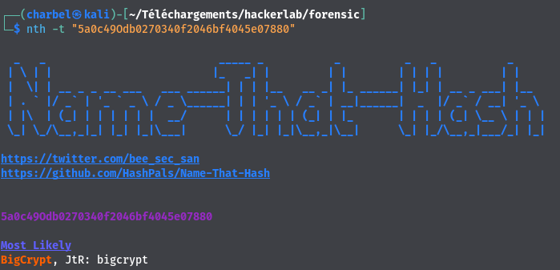
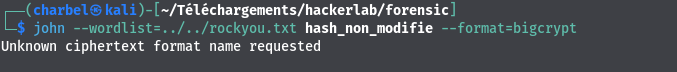
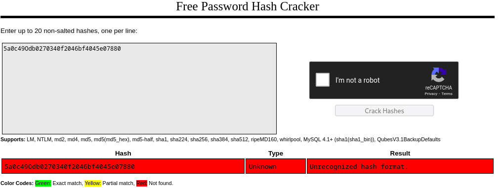
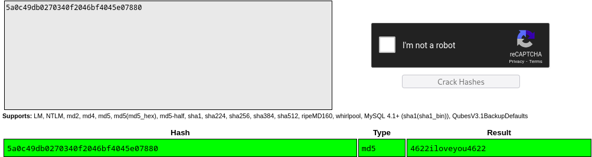

# 5ive
```
70 pts
```
## Description
```
Vite, crack ce mot de passe: 5a0c49Odb0270340f2046bf4045e07880.

```
## Outils utilisés
```
name that hash (nth)
crackstation online : https://crackstation.net/
john the ripper

```
## Solution
```
Le challenge nous fournit ce qu'il semble être le hash d'un mot de passe. Nous devons déterminer quel est le format du hash ,
avant de pouvoir tenter de le cracker.
Nous utiliserons pour cela l'outil name that hash

```
`>>> nth -t "5a0c49Odb0270340f2046bf4045e07880" `


```
Name that hash , nous dit que le format du hash est du Bigcrypt. Tentons de le cracker avec john the ripper.

```


```
Bizarrement john , ne reconnaît pas ce format.
Essayons avec l'outil en ligne crackstation.
```


```
Crackstation nous fait le même coup😭. Que se passe t-il ? Après avois failli laissez tomber , nous avons remarquer qu'il y'avait le caractère "O" qui était présent dans le hash
.Bizarre. Nous avons donc enlevé ce caractère, ce qui nous donne ceci: 5a0c49db0270340f2046bf4045e07880
Réessayons de le cracker avec crackstation online.

```


## Flag
```
CTF_4622iloveyou4622
```


