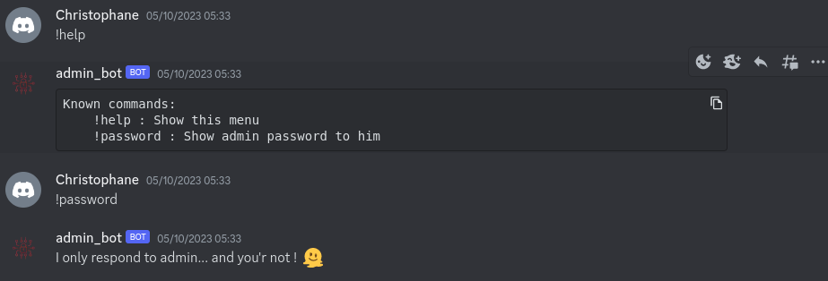
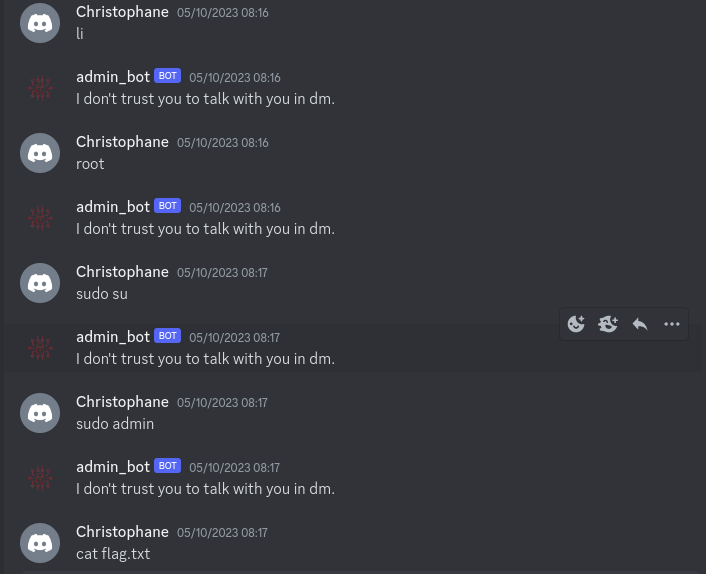
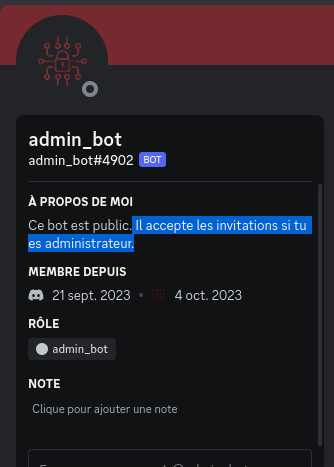
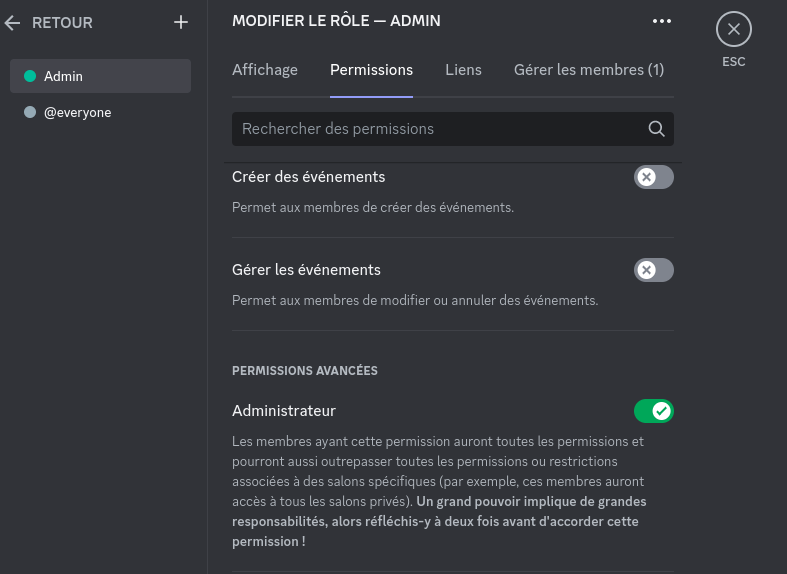
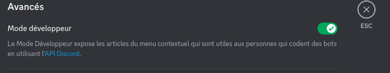
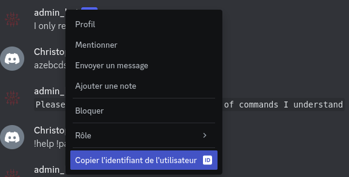
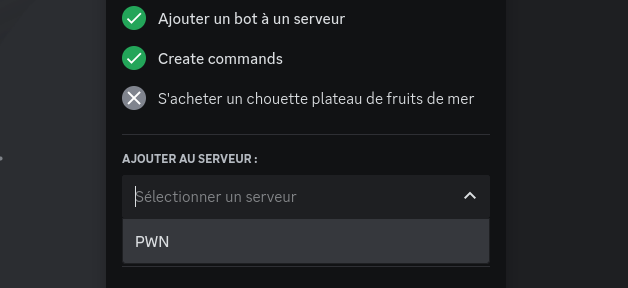
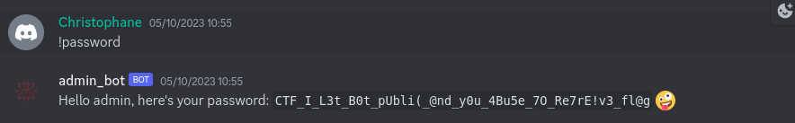

# Admin bot 
> 200 points
>
>[FR]
>
>Discuter avec le bot de l'administrateur dans le canal #admin_bot du discord HACKERLAB2023 et essayer de lui faire afficher le flag.
>
> 
>[EN]
>
>Chat with the administrator bot in channel #admin_bot on the HACKERLAB2023 Discord and try to get it to display the flag.
>
> 
> Author: 5c0r7

## Méthode de résolution
Ce challenge nous appelle à faire en sorte que `admin_bot` nous affiche le flag en lui faisant la causette dans le canal #admin_bot. Une fois dans le canal du bot, nous avons essayé quelques commandes pour voir son fonctionnement:

Le bot était clair et strict: Il nous faut être administrateur pour afficher le password admin ! Nous l'avons ensuite dm et refait quelques tests

Têtu ce bot! 

En consultant son profil, une phrase a retenu notre attention : 

En d'autres termes, en plus d'être un administrateur, il faut également inviter le bot. Après quelques recherches sur la toile , nous sommes tombés sur un article qui 
s'inscrivait parfaitement dans notre contexte. [Voir l'artcile](https://www.goglides.com/blog/x-mas-ctf/) 

Il faut donc inviter le bot sur un serveur dont nous sommes l'administrateur. C'était aussi simple que ça.

Pour résoudre ce challenge, il suffit de suivre les étapes ci après:

1. Attribution du droit d'administrateur  (Paramètres du serveur -> Roles  -> Permissions par défaut -> Bouton +

  Après avoir personnalisé le rôle, il faut ajouter activer le droit administrateur 
    
  
    
  Ensuite, il faut s'attribuer le nouveau rôle créé dans l'onglet `Gérer les membres`

2. Activation du mode développeur (Paramètres -> Paramètres de l'appli -> Avancés)

  
  
3. Sur le serveur `HackerLab 2023`, clic droit sur le bot et copie de l'id

  
  
4. Naviguation sur le lien suivant https://discordapp.com/oauth2/authorize?&client_id=1154312717918801930&scope=bot où client_id est l'id du bot

5. Sélection d'un serveur discord privé avec droit d'administrateur

  
  
6. Boom le bot est sur notre serveur

  
  

Une fois ces étapes effectuées, nous avons réessayé d'exécuter la commande `!password` pour obtenir notre flag 🥳. 

> Flag: CTF_I_L3t_B0t_pUbli(_@nd_y0u_4Bu5e_7O_Re7rE!v3_fl@g
