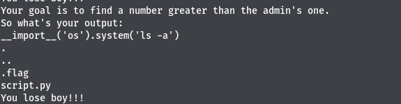
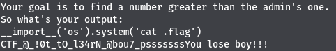

#   Rabbit
```
70pts
```
## Description
```
Pourrais-tu gagner?
```
## Solution
```
En analysant le script python voici ce qu'on peut en déduire:
- la version du python utilisé est python2.7
- le script reçoit un nombre en input , et compare ce nombre au nombre+1

En faisant des recherches , nous avons pu trouver que l'instruction input() de python2.7 était vulnérable
https://www.geeksforgeeks.org/vulnerability-input-function-python-2-x/
Il suffit juste d'envoyer comme input, du code python qui sera interpreté
```
`__import__('os').system('ls a')`



```
Nous pouvons voir un fichier .flag. Affichons ce fichier

```


## Flag
```
CTF_@_!0t_tO_l34rN_@bou7_psssssss
```
