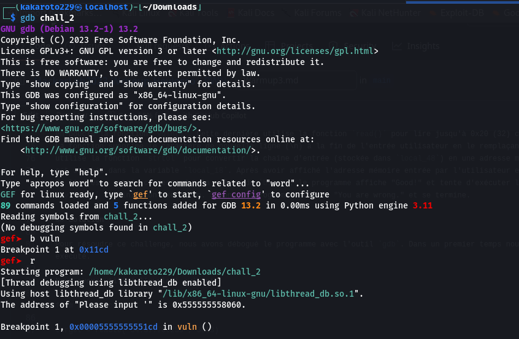
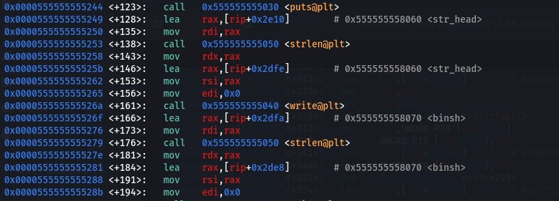
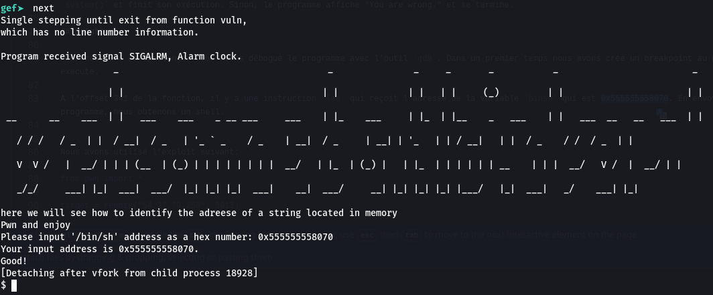

# WARMUP 3
> 70 points
>
> Author: W1z4rd

## Description
Pour ce challenge, l'auteur a joint un fichier binaire que nous avons décompilé avec `ghidra`. Nous avons découvert deux fonctions: `main()` et `vuln()`.

```c
void main(EVP_PKEY_CTX *param_1)
{
  init(param_1);
  printf("The address of \"%s\" is 0x%lx.\n",str_head,str_head);
  do {
    vuln();
  } while( true );
}

void vuln(void)
{
  size_t sVar1;
  ssize_t sVar2;
  char local_48 [40];
  char *local_20;
  char *local_18;
  int local_c;
  
  puts(
      "                     _                                       _               _     _       _            _                         _  \n "
      );
  puts(
      "                    | |                                     | |             | |   | |     (_)          | |                       | | \n "
      );
  puts(
      " __      __    ___  | |   ___    ___    _ __ ___     ___    | |_    ___     | |_  | |__    _    ___    | |   ___  __   __   ___  | | \n "
      );
  puts(
      "   / / /   / _  | |  / __|  / _   | \'_ ` _    / _    | __|  / _     | __| | \'_   | | / __|    | |  / _    / /  / _  | | \n "
      );
  puts(
      "   V  V /   |  __/ | | | (__  | (_) | | | | | | | |  __/   | |_  | (_) |   | |_  | | | | | |  __    | | |  __/   V /  |  __/ | | \n "
      );
  puts(
      "   _/_/     ___| |_|  ___|  ___/  |_| |_| |_|  ___|    __|  ___/     __| |_| |_| |_| |___/    |_|  ___|   _/    ___| |_| \n "
      );
  puts("here we will see how to identify the adreese of a string located in memory");
  puts("Pwn and enjoy");
  sVar1 = strlen(str_head);
  write(0,str_head,sVar1);
  sVar1 = strlen(binsh);
  write(0,binsh,sVar1);
  sVar1 = strlen(str_tail);
  write(0,str_tail,sVar1);
  sVar2 = read(0,local_48,0x20);
  local_c = (int)sVar2;
  local_48[local_c + -1] = '\0';
  local_18 = (char *)strtol(local_48,(char **)0x0,0x10);
  printf("Your input address is 0x%lx.\n",local_18);
  local_20 = local_18;
  if (local_18 == binsh) {
    puts("Good!");
    system(local_20);
                    /* WARNING: Subroutine does not return */
    exit(0);
  }
  puts("You are wrong.\n\n");
  return;
}

```
Dans sa fonction `main()`, le programme affiche l'adresse de la variable `str_head` puis une bannière. Ensuite il exécute en boucle la fonction `vuln()`. Cette dernière utilise la fonction `read()` pour lire jusqu'à 0x20 (32) caractères depuis l'entrée standard dans le tableau `local_48`.
La fonction supprime le caractère de nouvelle ligne (\n) à la fin de l'entrée utilisateur en le remplaçant par un caractère nul ('\0'). Ensuite, elle
utilise la fonction `strtol` pour convertir la chaîne d'entrée (stockée dans `local_48`) en une adresse mémoire en base 16 (0x10). Cette dernière 
est stockée dans la variable `local_18`. Après avoir affiché l'adresse mémoire entrée par l'utilisateur elle la stocke dans `local_20` et la compare à la valeur de `binsh`. Si l'adresse entrée correspond à la valeur de `binsh`, le programme affiche "Good!" et tente d'exécuter la commande `/bin/sh` stockée dans `local_20` à l'aide de la fonction `system()` et finit son exécution. Sinon, le programme affiche "You are wrong." et se termine.

## Solution

Pour résoudre ce challenge, nous avons débogué le programme avec l'outil `gdb`. Dans un premier temps nous avons créé un breakpoint au niveau de la fonction `vuln` puis exécuté. 



Dans un second temps, nous l'avons désassemblé.



A l'offset 341 de la fonction, il y a une instruction `lea` qui envoie l'adresse de la variable `binsh` qui est `0x555555558070` dans le registre `rax`. En continuant l'exécution du binaire, nous obtenons un shell en utilisant l'adresse découverte




Comme nous l'avons pu le remarquer dans le code assembleur de la fonction `vuln()`, le registre `rax` contient l'adresse de la variable `str_head` i.e `0x555555558060` avant de contenir celle `binsh`. Par ailleurs l'adresse `str_head` s'affiche et change à chaque exécution du programme. Donc pour retrouver l'adresse de binsh à chaque fois, il nous suffira d'ajouter l'offset 0x555555558070-0x555555558060=`0x10` à l'adresse connue de `str_head`.

En appliquant cela sur la machine netcat, nous obtenons le flag !


> Flag : CTF_C4n_y0u_1dent1fy_addr_valu3_in_memory
