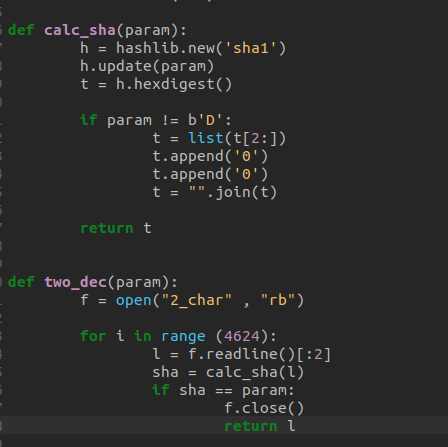

# Couvent Des Initiés
> 500 points
>
> Author: R!md0r

## Outils utilisés pour la résolution
* **Ghidra** pour la décompilation du binaire
* **Crunch** pour la génération de wordlists

## Fonctionnement 
À son exécution, le binaire demande une entrée de type string à l’utilisateur.
```
__isoc99_scanf(&DAT_0010359a,local_28);
```

Cette entrée utilisateur est envoyée une fonction nommée Tinkpon pour vérification.
```
  __isoc99_scanf(&DAT_0010359a,local_28);
  iVar1 = Tinkpon(local_28);
```

Si la vérification est correcte, le challenge est réussi sinon la tentative échoue. Afin de
résoudre ce challenge, nous allons donc nous concentrer sur la vérification qui est faite au
niveau de la fonction ```Tinkpon```.

La fonction Tinkpon suit le modèle de vérification suivant :
* La fonction prend n caractères successifs de l’entrée utilisateur (1 ≤ n ≤ 4). Les
caractères sont pris de manière évolutive de la gauche vers la droite jusqu’à la fin de
l’entrée utilisateur.
Notons A le string contenant les n caractères sélectionnés.
* La fonction Tinkpon effectue ensuite une des opération suivante sur chacun des
caractères du string A et fait une concaténation des résultats suivant la position du
caractère dans le string A
  * néant (pour dire qu’aucune opération n’est effectuée);
  * un xor;
  * un chiffrement césar.
    Notons C le résultat obtenu après concaténation
  * la fonction Tinkpon calcule le hash de C
  * ormi pour le premier C, la fonction Tinkpon supprime le premier octet du hash et ajoute l’octet 00 à la fin du hash.
    Notons Z cette opération
    Notons H le résultat obtenu après cette opération.
  * enfin la fonction Tinkpon compare H à la valeur attendue.

## Méthode de résolution
Pour résoudre ce challenge, nous allons déterminer les combinaisons de caractère ascii dont le hash modifié correspond aux valeurs attendues dans Tinkpon. 
Pour cela nous allons utiliser l’outil Crunch pour générer une wordlist de mots de taille n (la signification de n a été décrite précédemment).

Afin d'expliquer de manière pratique, nous allons utiliser la troisième valeur attendue par la fonction Tinkpon : `c8261cec9ddc2177740dac736b2d3d78bb897f00`


Dans la capture ci-dessus l’entrée utilisateur est contenue dans `param_1`
On remarque aisément que cette portion de code applique le chiffrement césar `caesarCipher`
sur chacun des 4ème et 5ème caractère de l’entrée utilisateur et fait une concaténation des
résultats `strncat`. Ensuite, elle effectue l’opération Z (précédemment définie) sur le hash du
résultat obtenu après concaténation. Enfin, elle compare le résultat de l’opération Z à
`c8261cec9ddc2177740dac736b2d3d78bb897f00`.

D’après l’explication précédente, on déduit que le résultat de l’opération Z a été obtenue à
partir de deux caractères donc nous allons générer une wordlist de mots de deux caractères
ascii.

```
crunch 2 2
"0123456789abcdefghijklmnopqrstuvwxyzABCDEFGHIJKLMNOPQRSTUVWXYZ\!\"#$%&\'()*+,-./:\;<=>?@[\\]^_\`{|}~ \t\n\r\x0b\x0c" -o 2_char
```

**Programme de bruteforce**



Suite à notre bruteforce, on obtient les caractères: `Vj`

Comme expliqué plus haut, un chiffrement césar est appliqué aux caractères initiaux avant
leur hashage. Nous allons donc inverser l’algorithme de ce chiffrement et appliquer
l’algorithme inverse aux caractères `Vj`.

**Code source de l'algorithme du chiffrement César**
```
uint caesarCipher(byte param_1,int param_2)

{
  uint uVar1;
  
  if (((char)param_1 < 'A') || ('Z' < (char)param_1)) {
    if (((char)param_1 < 'a') || ('z' < (char)param_1)) {
      uVar1 = (uint)param_1;
    }
    else {
      uVar1 = (param_2 + (char)param_1 + -0x61) % 0x1a + 0x61;
    }
  }
  else {
    uVar1 = (param_2 + (char)param_1 + -0x41) % 0x1a + 0x41;
  }
  return uVar1;
}
```

Consulter le lien suivant pour mieux comprendre le chiffrement césar :
[Chiffrement par décalage](https://fr.wikipedia.org/wiki/Chiffrement_par_d%C3%A9calage)

Nous avons ensuite écrit l'algorithme inverse du chiffrement césar:


`param` est le caractère à déchiffrer et `param_` est le nombre de rotation nécessaire pour le
déchiffrement. En notant, R (R ≤ 26) la rotation utilisée pour le chiffrement d’un caractère et
R_ (R_ ≤ 26) la rotation utilisée pour le déchiffrement, on obtient la formule F définie
comme suivant R_ = 26 - R .En se référant à la capture du processus d’obtention de la valeur à comparer à la valeur
attendue on déduit aisément que la rotation utilisée pour le premier caractère est 4 et celle
utilisée pour le second caractère est 5. Pour déchiffrer `Vj` on utilisera alors respectivement les
rotation 22 et 21. On obtient donc `Re`.

En conclusion, les caractères nécessaires pour que la comparaison à
`c8261cec9ddc2177740dac736b2d3d78bb897f00` soit vérifiée sont `R` et `e`.

**Note**
>Dans le cas ou l’opération xor (^)est utilisé, le décodage se fait de la sorte :
>Soit D le code ascii du caractère à déchiffrer et X le chiffre utilisé pour effectuer le xor. Le résultat R de déchiffrement est R = D ^ X

Après la réalisation des différentes étapes, on obtient le flag:
>Flag : CTF_Re_F0r_L!fe_2023

