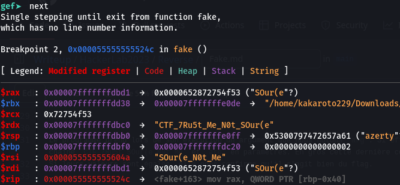

# Fake
> 30 points
>
>[FR]
>
>En qui as tu confiance ?
>[EN]
>
>What do you trust?
>
> 
> Author: 5c0r7

## Outils utilisés pour la résolution
* **Ghidra** pour la décompilation du binaire
* **gdb** pour le débogage

## Fonctionnement 
```c
{
  if (param_1 < 2) {
    puts("[+]Usage: ./source password");
  }
  else {
    fake("CTF_7Ru5t_SOur(e_N0t_Me",*(undefined8 *)(param_2 + 8));
  }
  return 0;
}
```

Le programme prend lors de son exécution un argument que nous notons `arg`. Si effectivement un argument est lui est passé, il exécute une fonction `fake` en lui envoyant la  chaine `CTF_7Ru5t_SOur(e_N0t_Me` et `arg` en paramètres. En gros cette dernière compare arg à une valeur stockée en mémoire `local_38` à l'aide de la fonction `strcmp`.
Si leurs valeurs sont égales, elle nous confirme qu'il s'agit bien du flag. 

## Solution
Pour résoudre ce challenge, nous avons crée un breakpoint au niveau de la fonction `fake` lors du déboguage. Après avoir désassemblé la fonction `fake`, nous avons créé un nouveau breakpoint à l'adresse de l'instruction d'appel de la fonction `strcmp`.


En continuant l'exécution du programme, nous obtenons notre flag contenu dans le registre `rdx`:



>Flag : CTF_7Ru5t_Me_N0t_SOur(e
