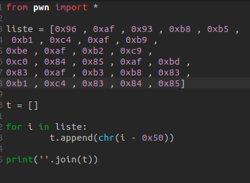

# SIKA-NETIC
> 200 points
>
>[FR]
>
>Pouvez-vous estimer la valeur de mes trésors (siká) ?.
>
>[EN]
>
> Can you estimate my real siká treasures values ?.
>
> 
> Author: W1z4rd

## Outils utilisés pour la résolution
* **Ghidra** pour la décompilation du binaire

## Fonctionnement 
À son exécution, le binaire demande une entrée de type entier ( integer ) à l’utilisateur.
```c
_scanf("%c",local_44);
```

Le programme vérifie une variable initialisée à 1000 `local_1c = 1000` est inférieur à 1 `if (local_1c < 1)`. Si la condition est vérifiée, 
le programme effectue un calcul et affiche le flag. Sinon, la tentative échoue.

## Solution
Pour résoudre ce challenge nous allons donc nous concentrer sur le calcul effectué lorsque la condition est vérifiée. Ce calcul est le suivant :
```c
  if (local_1c < 1) {
    _puts("    AH hAhAhAhAhAhA!!!                ");
    _puts("    Congrats, here\'s the flag:        ");
    local_14 = local_3b;
    while (*local_14 != '\0') {
      pcVar1 = local_14 + 1;
      *local_14 = *local_14 + -0x50;
      local_14 = pcVar1;
    }
    _puts(local_3b);
```
On remarque aisément dans cette capture que la programme fait une soustraction de 0x50 sur
chacune des valeurs contenues dans `local_3b` avant d’afficher le contenu de cette variable.
Lorsqu’on recherche le contenu de la variable `local_3b` dans le programme, on retrouve ceci :

```c
  local_3b[0] = -0x6d;
  local_3b[1] = 0xa4;
  local_3b[2] = 0x96;
  local_3b[3] = 0xaf;
  local_37 = 0x93;
  local_36 = 0xb8;
  local_35 = 0xb5;
  local_34 = 0xb1;
  local_33 = 0xc4;
  local_32 = 0xaf;
  local_31 = 0xb9;
  local_30 = 0xbe;
  local_2f = 0xaf;
  local_2e = 0xb2;
  local_2d = 0xc9;
  local_2c = 0xc0;
  local_2b = 0x84;
  local_2a = 0x85;
  local_29 = 0xaf;
  local_28 = 0xbd;
  local_27 = 0x83;
  local_26 = 0xaf;
  local_25 = 0xb3;
  local_24 = 0xb8;
  local_23 = 0x83;
  local_22 = 0xb1;
  local_21 = 0xc4;
  local_20 = 0x83;
  local_1f = 0x84;
  local_1e = 0x85;
  local_1d = 0;
  local_1c = 1000;
```

Il est donc facile de deviner que le flag s’obtient en soustrayant 0x50 à chacune des valeurs de la capture.



En utilisant le code ci-dessus, on obtient la valeur : `F_Cheat_in_byp45_m3_ch3at345`

>Flag : CTF_Cheat_in_byp45_m3_ch3at345

