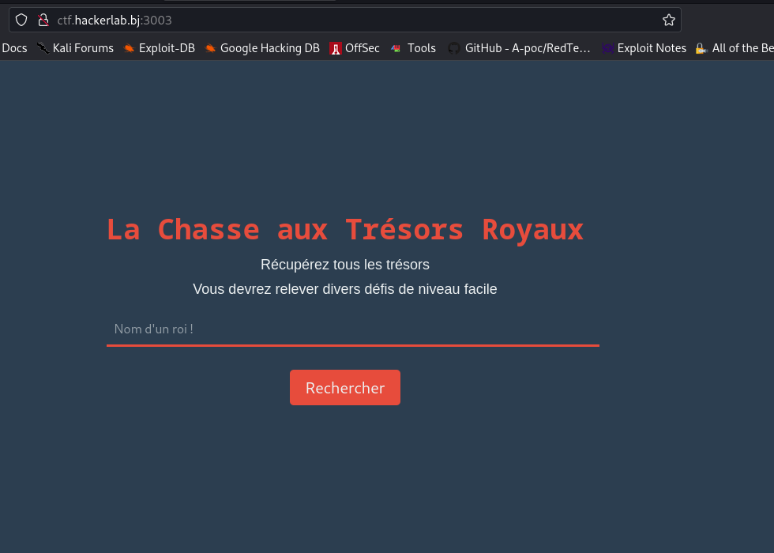
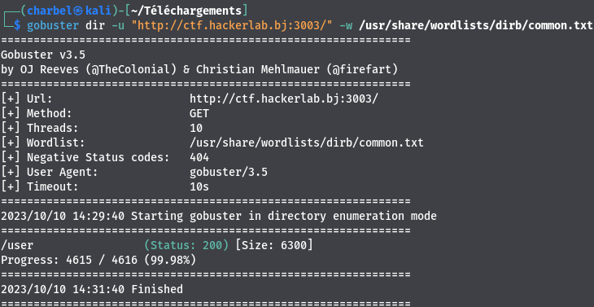
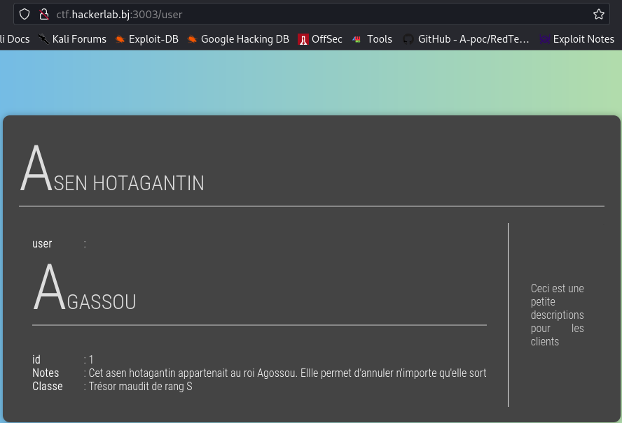
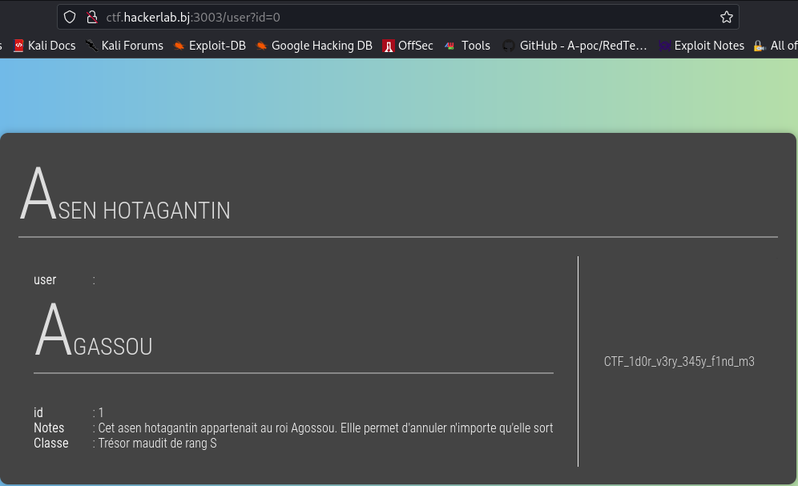

# Baby-hunter1:rodi
```
70 pts
```
## Description

```
Il s'agit d'une application présentant plusieurs vulnérabilités faciles à exploiter. 
Chaque vulnérabilité exploitée vous donne droit à un flag.
http://ctf.hackerlab.bj:3003

```
## Solution

> Dès que nous avons atterri sur l'URL fournie, nous avons été accueillis par cette page chaleureuse




> Nous avons fouillé le code de la page, mais rien d'extraordinaire à l'horizon. C'est alors que nous avons fait appel à notre fidèle compagnon, ```gobuster```, pour dénicher d'éventuelles pages cachées.

```gobuster dir -u "http://ctf.hackerlab.bj:3003/" -w /usr/share/wordlists/dirb/common.txt```



> Et voilà qu'apparaît une page nommée "user", qui a immédiatement capté notre attention.



> La page affiche les détails d'un utilisateur. Nous avons tout de suite flairé une vulnérabilité IDOR (Insecure Direct Object Reference).

> Mais comment accéder aux informations des autres utilisateurs dans ce cas? Après quelques recherches et tentatives, nous avons mis au point ce payload magique : http://ctf.hackerlab.bj:3003/user?id=1

> Cela nous dévoile les informations de l'utilisateur Asen Hotagantin. Prenons le risque d'envoyer zéro comme valeur au paramètre id.

`http://ctf.hackerlab.bj:3003/user?id=0`



## Flag
```
CTF_1d0r_v3ry_345y_f1nd_m3
```
