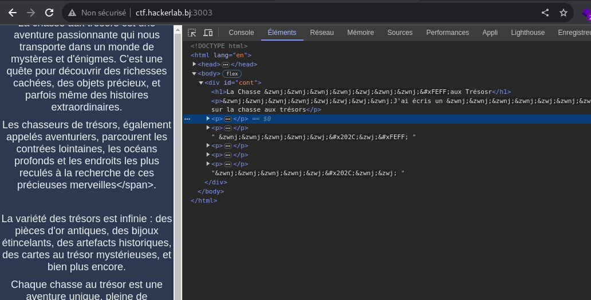
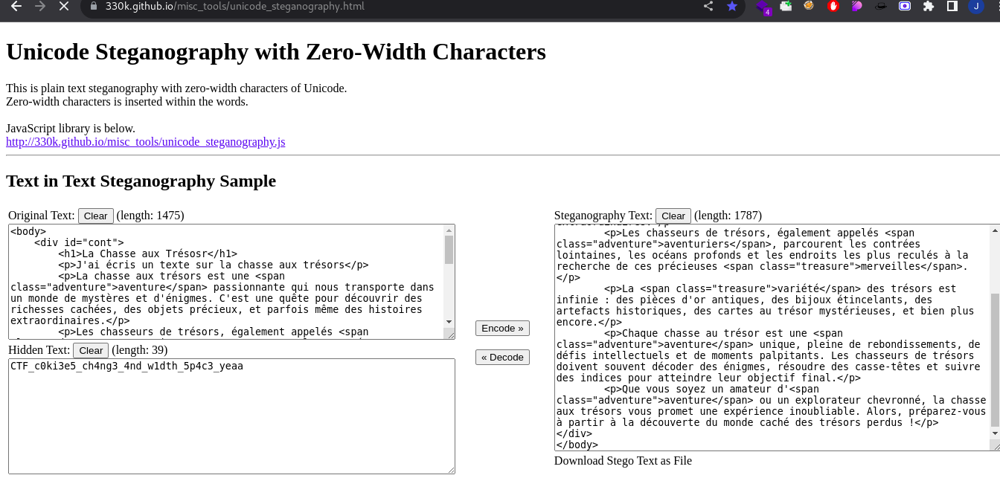

# Baby-hunter: cookies 🍪
```
70 pts
```

## Description
```
[FR]

J'aime les biscuits

[EN]

I like cookies

Author: W1z4rd

http://ctf.hackerlab.bj:3003
```

> Le lien du challenge nous dirige vers un site web. Le nom du challenge nous offre un indice crucial concernant le cookie.
> En inspectant les cookies, on remarque une valeur 'visitor' pour le cookie 'name'. Nous avons alors modifié la valeur de 'visitor' à 'admin'.

> Lorsque nous actualisons la page, les textes changent magiquement.😌

> En examinant les éléments de la page web, on remarque des caractères étranges dans le code 🤔. Cela nous a fait penser à une technique de stéganographie utilisant les 'caractères invisibles Unicode', puisqu'il n'y a rien de visible sur la page.



> Par la suite, nous avons utilisé cet outil en ligne pour obtenir le flag 🚀 ```https://330k.github.io/misc_tools/unicode_steganography.html```



# Flag
```CTF_c0ki3e5_ch4ng3_4nd_w1dth_5p4c3_yeaa``` 🎉
