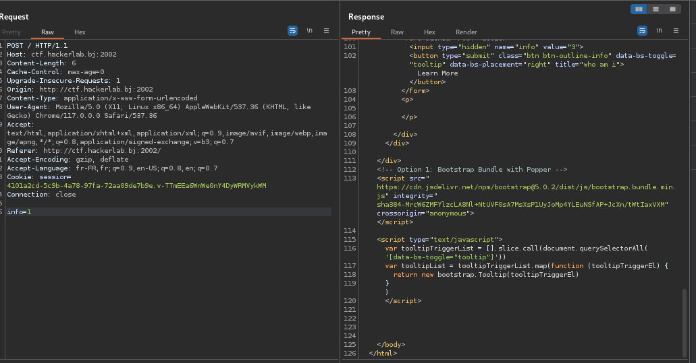
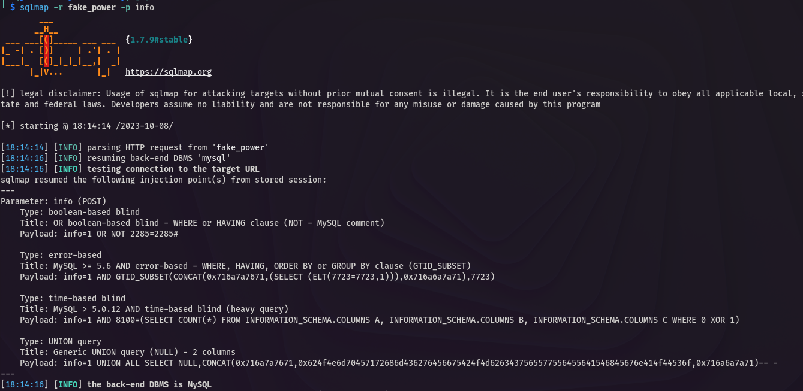
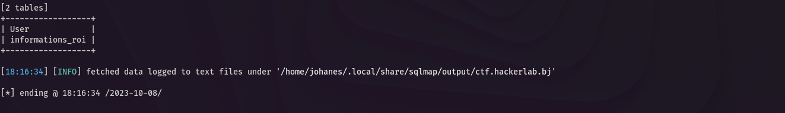
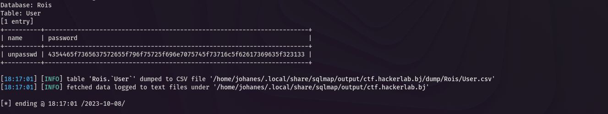
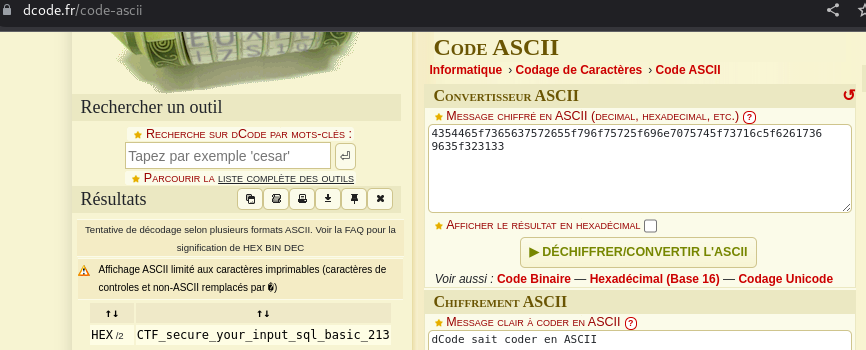

# FAKE_POWER 🔌
```
70 pts
```
## Description
```
[FR]
Le roi voulait tout sécuriser, mais il a oublié une porte.

[EN]
The king wanted to secure everything, but he forgot one door.

Author: unpasswd

http://ctf.hackerlab.bj:2002
```
> Le lien du challenge nous redirige vers un site web qui présente certains articles.
> Après avoir parcouru un peu le site sans rien voir de suspect 🥲, nous avons décidé d'intercepter les requêtes du site avec l'outil Burp Suite.
> Lorsqu'on clique sur le bouton 'LEARN MORE' sur le site, une requête POST est envoyée au serveur avec un paramètre *info*.



> Notre première idée a été une injection SQL. Nous avons donc copié la requête dans un fichier.


> Ensuite, nous avons utilisé l'outil sqlmap. ```sqlmap -r fake_power -p info```



> Bingo 🥳. Nous allons maintenant extraire les éléments de la base de données. ```sqlmap -r fake_power -p info -dbs``` pour afficher les bases de données.


> ```sqlmap -r fake_power -p info -D Rois --tables``` pour afficher les tables de la base de données "Rois".



> ```sqlmap -r fake_power -p info -D Rois --T User --dump``` pour afficher le contenu de la table "User".



> Nous avons utilisé l'outil en ligne *dcode* pour décoder le mot de passe de l'utilisateur.



# Flag

On obtient le flag 😎```CTF_secure_your_input_sql_basic_213``` 🚀
