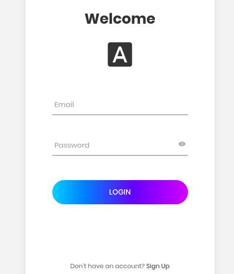
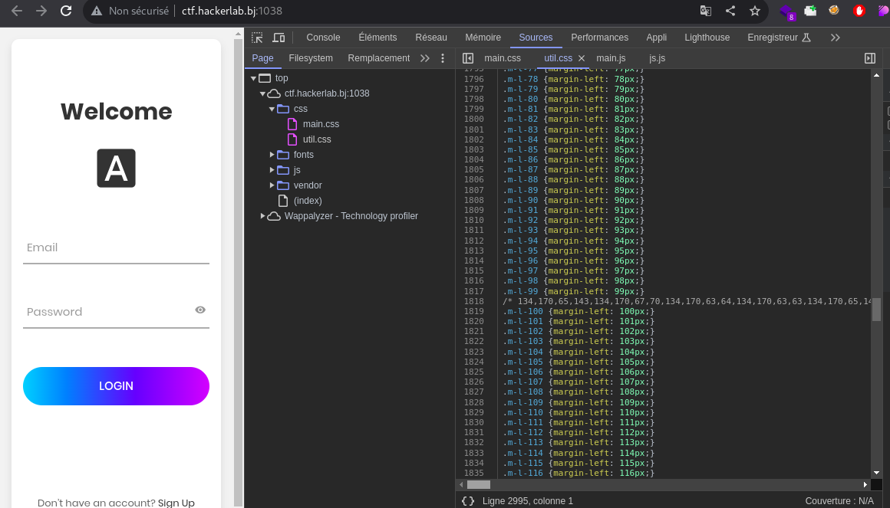
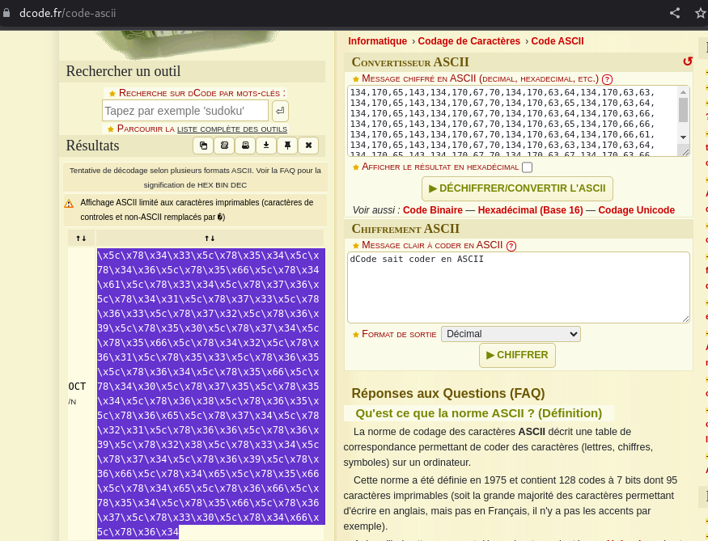
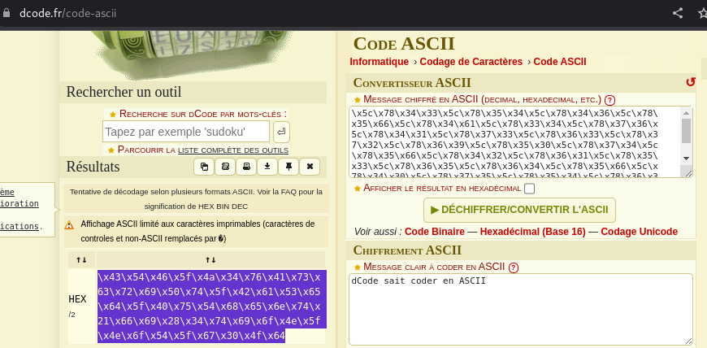
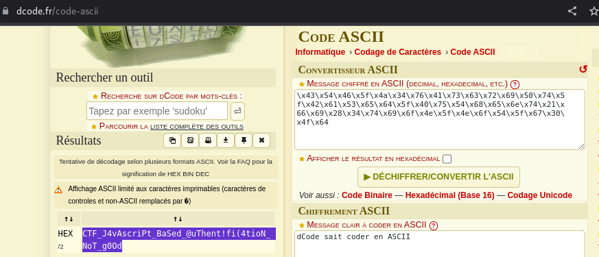

# Source 📜
```
70 pts
```
## Description
```
[FR]
Il ne suffit pas de s'authentifier.

[EN]
It is not enough to authenticate.

Author: 5c0r7

http://ctf.hackerlab.bj:1038
```
> Le lien du challenge nous mène vers un site web qui présente un formulaire de connexion.


 
> Lorsqu'on regarde le nom et la description du challenge, on se rend compte immédiatement qu'il faut étudier les sources du site web.

> Dans les sources du site, on tombe sur un fichier utils.js qui contient une ligne commentée.🙂



> On utilise l'outil en ligne dcode ```https://www.dcode.fr/code-ascii``` pour décoder le code trouvé.



> On obtient un résultat hexadécimal intéressant



> Une fois décodé, on obtient un autre code hexadécimal. 😩



> Une fois décoder on obtient le flag 😎

# Flag
 ```CTF_J4vAscriPt_BaSed_@uThent!fi(4tioN_NoT_g0Od``` 🚩
